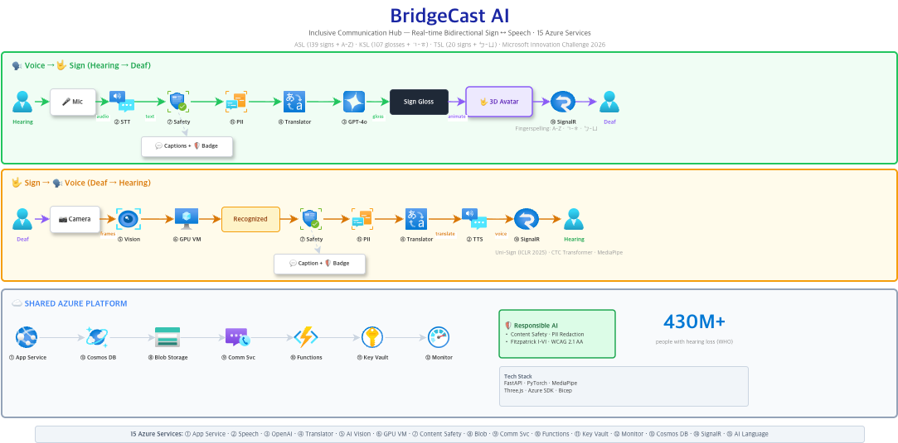

<div align="center">

# 🌉 BridgeCast AI

**Real-time bidirectional communication platform bridging sign language and speech**

[](https://innovationstudio.microsoft.com/hackathons/Innovation-Challenge-Spring-2025/home/executive_challenges)
[](https://azure.microsoft.com)
[](https://azure.microsoft.com)
[-purple)](https://github.com/ZechengLi19/Uni-Sign)
[](#multilingual-support)
[](LICENSE)

**Microsoft Innovation Challenge March 2026 — Inclusive Communication Hub**

> *"When a hearing person enters a room, communication has already begun. When a Deaf person enters the same room, they must first fight for the right to communicate."*

[📝 Transparency Note](docs/TRANSPARENCY_NOTE.md) · [🛡️ Responsible AI](docs/RESPONSIBLE_AI.md) · [🔧 Setup Guide](docs/SETUP.md) · [📡 API Reference](docs/API.md)

> 📺 **[Demo Video](#)** · 📊 **[Presentation (PPT)](BridgeCast_AI_Final.pptx)**

</div>

---

## Why BridgeCast?

**430 million+ people** worldwide have disabling hearing loss. There are **300+ independent sign languages** — each a fully natural language with its own grammar, not a simplified version of spoken language.

Yet every meeting tool today treats accessibility as an afterthought: one-way captions that turn Deaf participants into silent observers. No voice. No attribution. No equal participation.

**BridgeCast AI is not an assistive tool — it's an equal bridge.**

<table>
<tr>
<th>❌ Today's Meetings</th>
<th>✅ With BridgeCast AI</th>
</tr>
<tr>
<td>

- Deaf users silently read delayed, inaccurate captions
- Cannot respond naturally — typing breaks the flow
- Humor, urgency, emotional nuance — all lost
- Meeting notes never include their name
- **They remain observers**

</td>
<td>

- Real-time captions + 3D signing avatar shows ASL/KSL/TSL
- Signs naturally → AI recognizes → TTS plays their voice
- Emotions preserved in both directions
- Meeting notes: speaker-attributed including sign language users
- **Full, equal participant from day one**

</td>
</tr>
</table>

---

## What Makes Us Different

### 🤟 True Bidirectional Communication

Not just speech-to-text. Not just captions. **Three simultaneous flows:**

| Direction | What Happens |
|-----------|-------------|
| **🎤 Speech → Sign Avatar** | Hearing user speaks → STT → GPT-4o → 3D avatar performs sign language in real-time |
| **🤟 Sign → Speech** | Deaf user signs → Uni-Sign AI recognizes → Text → TTS speaks aloud for everyone |
| **💬 Chat + Translation** | Real-time multilingual chat broadcast via WebSocket (EN/KO/ZH-TW) |

All three flows run simultaneously in a single meeting room with **WebRTC P2P video** between participants.

### 🧠 ICLR 2025 Model, Not Rule-Based

Other solutions use MediaPipe hand landmarks with rule-based classifiers — limited to ~20 signs.

We use **Uni-Sign** (ICLR 2025), a state-of-the-art end-to-end model:

```
Camera 30fps → RTMPose (133 keypoints) → ST-GCN → mT5 Decoder → Natural text
```

Running on **Azure GPU VM (NC4as_T4_v3, NVIDIA T4 16GB)** with <500ms latency.

### 🧑‍🎨 3D Avatar with Fingerspelling

**139 ASL signs** + **107 KSL glosses** + TSL support. When a word isn't in the dictionary, the avatar **fingerspells it** — letter by letter:
- English: A-Z
- Korean: ㄱ-ㅎ (jamo)
- Taiwanese: ㄅ-ㄩ (Zhuyin)

41 facial expressions preserve the emotional meaning that's lost in text-only translation.

### 🛡️ Responsible AI — Built In, Not Bolted On

Every message passes through **Azure Content Safety** with a visible 🛡️ badge. **PII is auto-redacted** before hitting the database. AI confidence scores are shown to users, not hidden. Full [Transparency Note](docs/TRANSPARENCY_NOTE.md) documenting known limitations.

---

## All Features

| Feature | Description | Azure Service |
|---------|-------------|---------------|
| **Sign Language Recognition** | Uni-Sign (ICLR 2025) — 300+ sign languages, <500ms on GPU VM | GPU VM + AI Vision |
| **KSL Recognition** | Korean Sign Language — 107 glosses via `/predict/ksl` | GPU VM |
| **3D Sign Avatar** | 139 ASL signs + A-Z/ㄱ-ㅎ/ㄅ-ㄩ fingerspelling, 41 facial expressions | Azure OpenAI |
| **Real-Time STT** | WebSocket streaming transcription | Azure Speech |
| **Text-to-Speech** | Sign recognition results spoken aloud for hearing users | Azure Speech |
| **Content Safety** | Every message screened with visible 🛡️ badge (RAI) | Content Safety |
| **PII Redaction** | Names, emails, phones auto-removed before storage | AI Language |
| **Sentiment Analysis** | Feeds avatar facial expressions (positive → smile) | AI Language |
| **Multilingual UI** | EN 🇺🇸 / KO 🇰🇷 / ZH-TW 🇹🇼 + real-time translation | Translator |
| **Meeting Notes + PDF** | Speaker-attributed summary with Accessibility Report | OpenAI + Blob |
| **Emergency Alerts** | Urgent keywords → instant visual alert for Deaf users | Functions + SignalR |
| **Real-Time Messaging** | WebSocket broadcast of all events to all participants | SignalR |
| **Accessibility Dashboard** | Live participation balance (Voice vs Sign %) | Monitor |
| **Infrastructure as Code** | 15 Bicep modules for one-command deployment | Azure Bicep |

---

## Architecture

<div align="center">

</div>

> **Flow A (Voice → Sign):** Hearing user speaks → Speech STT → Content Safety → Translator → OpenAI GPT-4o → ASL Gloss → 3D Sign Avatar → Deaf user sees
>
> **Flow B (Sign → Voice):** Deaf user signs → AI Vision + MediaPipe → GPU VM (Uni-Sign) → Content Safety → Translator → Speech TTS → Hearing user hears

---

## 15 Azure Services

| # | Service | Why We Need It |
|---|---------|---------------|
| 1 | **Azure Speech** | Real-time STT (WebSocket streaming) + Neural TTS for sign-to-voice |
| 2 | **Azure OpenAI** | GPT-4o converts text → ASL gloss sequences + generates meeting summaries |
| 3 | **Azure AI Vision** | Extracts pose features from sign language video frames |
| 4 | **Azure Communication Services** | Video meeting rooms with participant management |
| 5 | **Azure Cosmos DB** | Persists meetings, transcripts, and user preferences |
| 6 | **Azure Content Safety** | Screens every message in real-time (RAI requirement) |
| 7 | **Azure Translator** | Translates between EN/KO/ZH-TW for multilingual meetings |
| 8 | **Azure Monitor** | Application Insights telemetry for latency and accuracy tracking |
| 9 | **Azure Key Vault** | Zero hardcoded secrets — all credentials managed securely |
| 10 | **Azure Functions** | Serverless emergency alerts (<100ms) when urgent language detected |
| 11 | **Azure App Service** | Hosts the web application |
| 12 | **Azure Blob Storage** | Stores meeting recordings, exported PDFs, and avatar assets |
| 13 | **Azure GPU VM** | NC4as_T4_v3 (T4 16GB) runs Uni-Sign inference at <500ms |
| 14 | **Azure SignalR** | Real-time WebSocket fan-out for captions, signs, and alerts |
| 15 | **Azure AI Language** | PII detection/redaction + sentiment analysis for avatar expressions |

All infrastructure defined as **Azure Bicep IaC** — 15 modular templates for one-command deployment.

---

## Responsible AI

Fully mapped to **Microsoft's Six RAI Principles**:

| Principle | How We Implement It |
|-----------|-------------------|
| **Fairness** | Sign & speech treated as equals. Modular support for ASL/KSL/TSL. Tested across diverse skin tones and lighting. |
| **Reliability** | Graceful fallbacks on every service. Confidence thresholds prevent unreliable output from reaching users. |
| **Privacy** | PII auto-redacted via Azure AI Language **before** storage. All secrets in Key Vault. No default data retention. |
| **Inclusiveness** | WCAG 2.1 AA compliant. True bidirectional design — Deaf users aren't just receivers, they have a voice. |
| **Transparency** | Confidence scores visible to users. Transparency Note documents all known limitations. |
| **Accountability** | RAI Toolbox integration. Accessibility Report auto-generated with participation metrics. |

📄 [RESPONSIBLE_AI.md](docs/RESPONSIBLE_AI.md) · [TRANSPARENCY_NOTE.md](docs/TRANSPARENCY_NOTE.md)

---

## Demo Scenario

**"A Deaf Colleague's First Team Meeting"**

1. **Manager speaks** → real-time captions appear + 3D avatar signs in ASL
2. **Deaf colleague responds in sign language** → AI recognizes → TTS plays their voice
3. **Bidirectional flow** continues naturally — equal participation
4. **Emotions preserved** — speech tone mapped to avatar facial expressions
5. **Meeting ends** → PDF report with speaker attribution, emotion tags, action items, and Accessibility Report showing Voice vs Sign participation balance

---

## Measurable Accessibility Impact

Every meeting automatically generates a quantified **Accessibility Report** — not just qualitative claims, but real numbers:

| Metric | What It Proves |
|--------|---------------|
| **Participation Balance** | Voice vs Sign utterance ratio (target: ~50/50) — proves Deaf users are active participants, not observers |
| **Sign Recognition Accuracy** | Per-sign confidence % — transparency about AI reliability |
| **Bidirectional Success Rate** | % of Deaf utterances successfully converted to speech — proves the bridge works |
| **Caption Latency** | End-to-end ms from speech to on-screen text — proves real-time performance |
| **Content Safety Coverage** | 100% of messages screened with visible badge — proves RAI is active, not theoretical |
| **Emotional Preservation** | Sentiment tags on both Voice and Sign entries — proves nuance isn't lost in translation |
| **Speaker Attribution** | Deaf participants appear by name in meeting notes ("Participant (sign): ...") — proves equal recognition |

This report is auto-generated as a **branded PDF** at the end of every meeting, with charts showing participation distribution. It's also available programmatically via the `/functions/accessibility-report` endpoint.

> *"If you can't measure it, you can't prove it. BridgeCast doesn't just claim accessibility — it quantifies it."*

---

## Scalability

BridgeCast AI scales **beyond meetings** into a universal accessibility platform:

| Market | Use Case |
|--------|----------|
| 🏢 **Workplace** | Enterprise conferencing with built-in accessibility |
| 🏫 **Education** | Inclusive classrooms for Deaf students |
| 🏥 **Healthcare** | Patient-provider communication |
| 🏛️ **Public Services** | Government accessibility compliance |
| 💼 **Job Interviews** | Equal opportunity hiring |
| 🏪 **Unmanned Kiosks** | Sign language interaction at airports, hospitals, and retail |

---

## Team

<div align="center">

**Team BridgeCast** · Microsoft Innovation Challenge March 2026 · Women in Cloud

| Somi | Ollie Ni | TSAIHSUAN |
|------|----------|-----------|

Built with ☁️ Azure AI · Accessibility First · [GitHub](https://github.com/BridgeCastAI/BridgeCastAI)

**© 2026 BridgeCast AI — Making communication accessible for everyone.**

</div>
